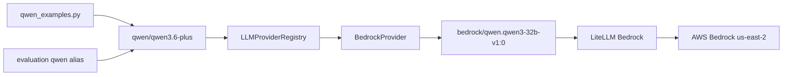

# Qwen Bedrock Provider Plan

## Remember

- Exact file paths always
- Exact commands with expected output
- DRY, YAGNI, TDD, frequent commits
- Maximum safely delegable parallelism
- Delegated tasks must be impossible to misread

## Overview

Build a new Bedrock provider under `[models/llm/providers/](models/llm/providers/)` and update `[models/llm/config/models.yaml](models/llm/config/models.yaml)` so repo-facing Qwen usage remains unchanged while LiteLLM routes to AWS Bedrock. The public model id, evaluation metadata, metrics keys, and deduplication identity will remain `qwen/qwen3.6-plus`; only provider internals translate to `bedrock/qwen.qwen3-32b-v1:0`.

Plan assets path: `[docs/plans/2026-04-24_qwen_bedrock_provider_482913/](docs/plans/2026-04-24_qwen_bedrock_provider_482913/)`.

## Happy Flow

1. `[models/llm/smoke_tests/qwen_examples.py](models/llm/smoke_tests/qwen_examples.py)` continues to call `run_batch_example_query(..., model="qwen/qwen3.6-plus")` with no public API change.
2. `[models/llm/models.py](models/llm/models.py)` keeps `QwenModel.resolved_model_id = "qwen/qwen3.6-plus"`, so evaluation metadata, metrics, and deduplication continue using the current identity.
3. `[models/llm/providers/registry.py](models/llm/providers/registry.py)` resolves `qwen/qwen3.6-plus` to the new `BedrockProvider` because `[models/llm/config/models.yaml](models/llm/config/models.yaml)` lists Qwen under `models.bedrock.supported_models`.
4. `BedrockProvider.prepare_completion_kwargs(...)` maps `qwen/qwen3.6-plus` to LiteLLM model `bedrock/qwen.qwen3-32b-v1:0`, merges config kwargs, attaches `aws_region_name="us-east-2"`, and optionally attaches `aws_profile_name` from configuration or `AWS_PROFILE`.
5. `[models/llm/llm_service.py](models/llm/llm_service.py)` calls `litellm.completion` or `batch_completion` without forcing an API key for Bedrock, letting AWS credentials resolve through LiteLLM/boto3.
6. LiteLLM returns OpenAI-shaped responses, and existing structured parsing in `LLMService.handle_completion_response(...)` and `handle_batch_completion_responses(...)` remains unchanged.

## Interface Or Contract Freeze

- Public Qwen model id remains `qwen/qwen3.6-plus`.
- `QwenModel.resolved_model_id` in `[models/llm/models.py](models/llm/models.py)` remains `qwen/qwen3.6-plus`.
- `[models/llm/smoke_tests/qwen_examples.py](models/llm/smoke_tests/qwen_examples.py)` remains behaviorally identical: no caller-visible model string change.
- `[evaluation/smoke_tests/model_specific/qwen.py](evaluation/smoke_tests/model_specific/qwen.py)` remains behaviorally identical: still calls `run_harness_smoke_test("qwen")`.
- `OpenRouterProvider` continues to support `minimax/minimax-m2.5`; it must no longer support `qwen/qwen3.6-plus`.
- Bedrock auth uses AWS credentials/region/profile, not `OPENROUTER_API_KEY`.
- No UI files are involved, so no screenshots are required.

## Serial Coordination Spine

1. Update provider protocol/API-key handling first because all providers pass through `[models/llm/llm_service.py](models/llm/llm_service.py)`.
2. Add `BedrockProvider` and register it.
3. Move Qwen config from `openrouter` to `bedrock` in `[models/llm/config/models.yaml](models/llm/config/models.yaml)`.
4. Update tests to assert Qwen routes to Bedrock and OpenRouter still handles MiniMax.
5. Run focused tests, then live smoke tests with AWS credentials.

## Parallel Task Packets

### Task A: Bedrock Provider Unit

- Objective: Add `BedrockProvider` with config-backed supported models and LiteLLM Bedrock model mapping.
- Why parallelizable: It can be implemented against the frozen provider protocol once the optional API-key contract is known.
- Inspect: `[models/llm/providers/openrouter_provider.py](models/llm/providers/openrouter_provider.py)`, `[models/llm/providers/anthropic_provider.py](models/llm/providers/anthropic_provider.py)`, `[experiments/2026-04-24_aws_bedrock/experiment.py](experiments/2026-04-24_aws_bedrock/experiment.py)`.
- Allowed to change: `[models/llm/providers/bedrock_provider.py](models/llm/providers/bedrock_provider.py)`.
- Forbidden to change: `[models/llm/models.py](models/llm/models.py)`, smoke-test entrypoints, evaluation harness.
- Preconditions: Optional API-key contract is finalized.
- Required invariants: public model id in, LiteLLM Bedrock model id out; region defaults to `us-east-2`; structured output format remains JSON schema compatible with existing service parsing.
- Verification: `PYTHONPATH=. uv run pytest tests/models/llm -q` should pass after integration tests are added.

### Task B: Registry And Config Routing

- Objective: Route `qwen/qwen3.6-plus` to Bedrock and leave MiniMax on OpenRouter.
- Why parallelizable: Config and registry changes are isolated from provider implementation once class name and provider name are frozen.
- Inspect: `[models/llm/config/models.yaml](models/llm/config/models.yaml)`, `[models/llm/providers/registry.py](models/llm/providers/registry.py)`, `[tests/models/llm/test_provider_registry.py](tests/models/llm/test_provider_registry.py)`.
- Allowed to change: those three files only.
- Forbidden to change: `[models/llm/models.py](models/llm/models.py)`.
- Preconditions: `BedrockProvider.provider_name == "bedrock"`.
- Required invariants: `qwen/qwen3.6-plus` appears under `models.bedrock.supported_models`; it does not appear under `models.openrouter.supported_models`.
- Verification: provider registry tests assert Qwen resolves to `BedrockProvider` and MiniMax resolves to `OpenRouterProvider`.

### Task C: LLMService Auth Boundary

- Objective: Let providers opt out of `api_key` so Bedrock can use AWS credentials.
- Why parallelizable: This is a small contract change with clear behavior.
- Inspect: `[models/llm/providers/base.py](models/llm/providers/base.py)`, `[models/llm/llm_service.py](models/llm/llm_service.py)`, existing providers.
- Allowed to change: `[models/llm/providers/base.py](models/llm/providers/base.py)`, `[models/llm/llm_service.py](models/llm/llm_service.py)`, provider classes only if typing requires it.
- Forbidden to change: evaluation files and smoke-test files.
- Preconditions: Provider protocol decision: `api_key` returns `str | None`.
- Required invariants: OpenAI, Anthropic, and OpenRouter still pass `api_key`; Bedrock does not.
- Verification: existing provider tests pass and a Bedrock provider test confirms no fake key is required.

## Integration Order

1. Land Task C first: update provider protocol and `LLMService` to conditionally include `api_key` only when not `None`.
2. Land Task A: add `BedrockProvider` with public-to-runtime id mapping and AWS kwargs.
3. Land Task B: register Bedrock, move Qwen config, and update registry tests.
4. Add or update provider-specific tests for Bedrock completion kwargs.
5. Run offline tests before any live AWS smoke tests.

## Manual Verification

- Run `PYTHONPATH=. uv run pytest tests/models/llm -q`. Expected: all model/provider tests pass, including Qwen resolving to `BedrockProvider`.
- Confirm OpenRouter no longer requires `OPENROUTER_API_KEY` for Qwen by running with AWS credentials only: `AWS_REGION=us-east-2 PYTHONPATH=. uv run python -m models.llm.smoke_tests.qwen_examples`. Expected: batch labels print for all example texts.
- Run the existing evaluation smoke test unchanged: `AWS_REGION=us-east-2 PYTHONPATH=. uv run python -m evaluation.smoke_tests.model_specific.qwen`. Expected: first run classifies all rows, second run dedupes to zero incremental rows.
- Inspect the smoke output logs. Expected: resolved model id printed by the harness remains `qwen/qwen3.6-plus`.
- If using AWS SSO, first run `aws sso login --profile <profile>` and then `AWS_PROFILE=<profile> AWS_REGION=us-east-2 PYTHONPATH=. uv run python -m models.llm.smoke_tests.qwen_examples`.

## Final Verification

- `qwen/qwen3.6-plus` remains the public and evaluation identity.
- `BedrockProvider.prepare_completion_kwargs(...)` sends `model="bedrock/qwen.qwen3-32b-v1:0"` to LiteLLM.
- `OPENROUTER_API_KEY` is no longer needed for Qwen.
- Existing MiniMax/OpenRouter behavior remains intact.
- Existing OpenAI and Anthropic provider tests remain intact.
- Live Qwen smoke tests succeed against Bedrock in `us-east-2`.

## Alternative Approaches

- Expose `bedrock/qwen.qwen3-32b-v1:0` directly to callers: rejected because public-facing usage must remain identical.
- Store Bedrock identity in evaluation metadata and dedup keys: rejected per chosen policy to preserve `qwen/qwen3.6-plus` as the resolved model id.
- Return a fake Bedrock API key from `BedrockProvider`: rejected because Bedrock uses AWS credentials and the service boundary should model that truthfully.
- Bypass LiteLLM and call boto3 directly in `BedrockProvider`: rejected initially because the existing provider architecture is LiteLLM-based and PR #38 already showed LiteLLM-compatible response shape through Bedrock.

